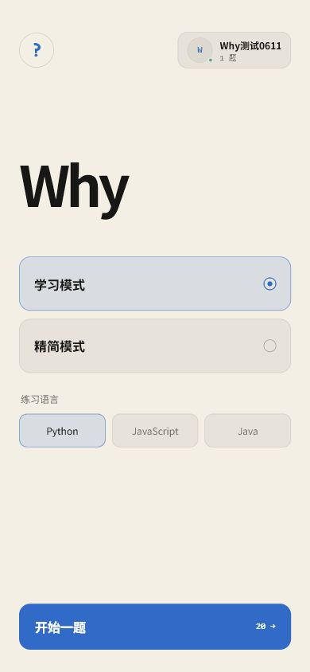
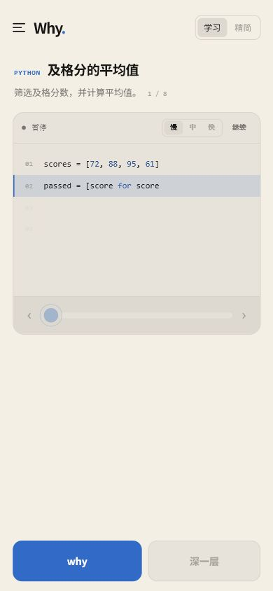
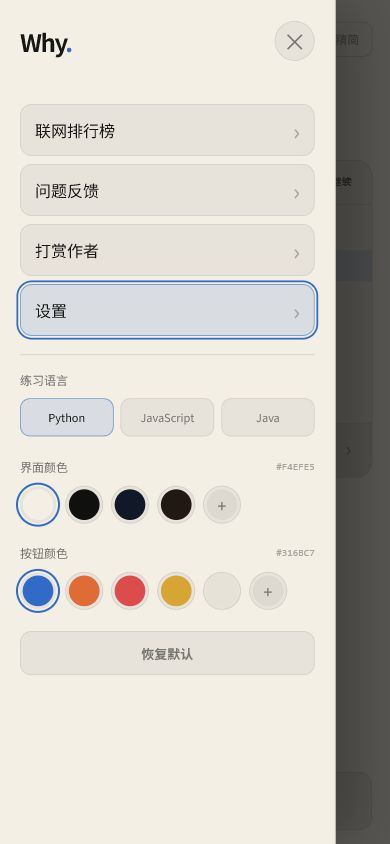
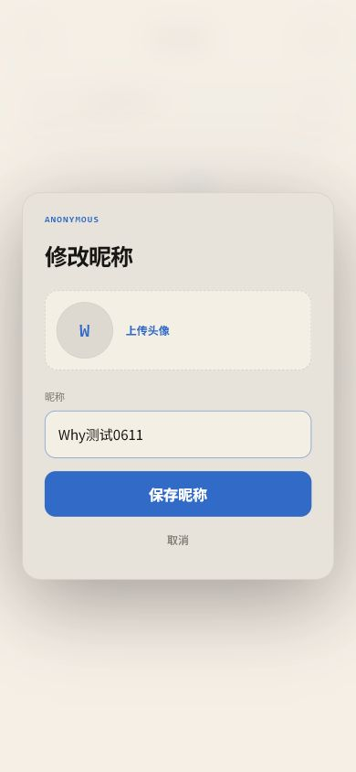
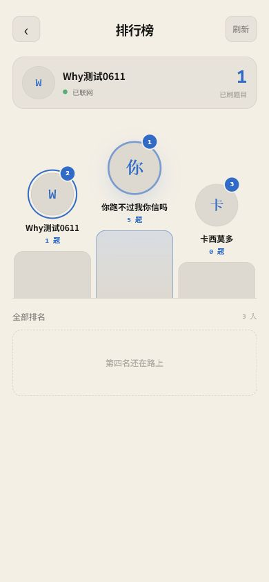

# Why

Why 是一个轻量代码学习 App。用户先阅读题目，再观看答案慢速写出；遇到不懂的代码行时，只需点 why 查看解释，再点“深一层”逐层深入。

## 最新版本

Android 交付版：**v2.0.0**

- [下载 Why v2.0.0 APK](https://github.com/XingranWang-ai/WHY-coding-app/releases/download/v2.0.0/Why-v2.0.0-debug.apk)
- [查看完整安装说明](docs/v2.0.0/安装说明.md)
- Android 7.0 及以上
- SHA-256：`A5336ACC9FDF0C2D9C7DDD0BF5E1E4E9B7B86AC10B6A2D1D75F617A931B31F7D`

### v2.0.0 更新

- 首页模式选择移除辅助小字，界面更简洁
- 首页左上角可打开侧边栏
- 首页右上角账号卡可直接编辑昵称和头像
- 侧边栏新增“返回首页”
- 侧边栏新增“联系作者”，展示作者 QQ 和完整 GitHub 仓库地址
- GitHub 仓库支持一键打开，更新失败时可手动前往仓库下载
- 版本号升级至 2.0.0（versionCode 14）

## 已实现

- 学习模式：逐句讲透语法、执行过程与底层原理
- 精简模式：保留重点的三层解释
- 读题倒计时与慢速自动书写
- 慢 / 中 / 快三档书写速度
- 双击代码区或点击暂停键暂停、继续
- 已完成代码行可随时点击回看
- 手机端 why / 深一层触屏操作
- 默认 Python，可切换 JavaScript 与 Java
- 内置 108 道题，30 道高详解题优先展示
- 无密码匿名注册，只需输入昵称
- 支持上传头像，头像会压缩后与昵称一起同步
- 联网排行榜按累计刷题数量排名
- 排行榜使用独立页面，前三名在顶端突出展示
- 断网时题量保存在本机，恢复联网后继续同步
- 大尺寸横向滑轨可移动代码显示范围
- 侧边栏包含问题反馈、打赏作者和设置
- 支持自定义界面颜色与按钮颜色
- 默认米白页面与蓝色按钮，设置中保留黑橙配色
- Capacitor Android 原生壳

## 界面预览

| 首页 | 学习界面 | 侧边栏 |
| --- | --- | --- |
|  |  |  |

| 匿名注册 | 联网排行榜 |
| --- | --- |
|  |  |

## 本地运行

```powershell
npm.cmd install
npm.cmd run dev
```

## Android

```powershell
npm.cmd run android:build
```

源码构建产物位于项目根目录。当前 v2.0.0 Android 交付包请从 GitHub Releases 下载。
