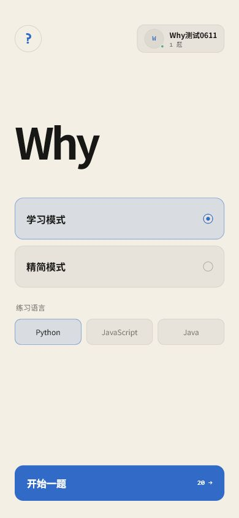
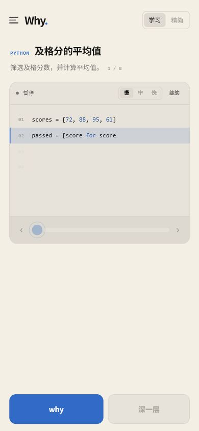
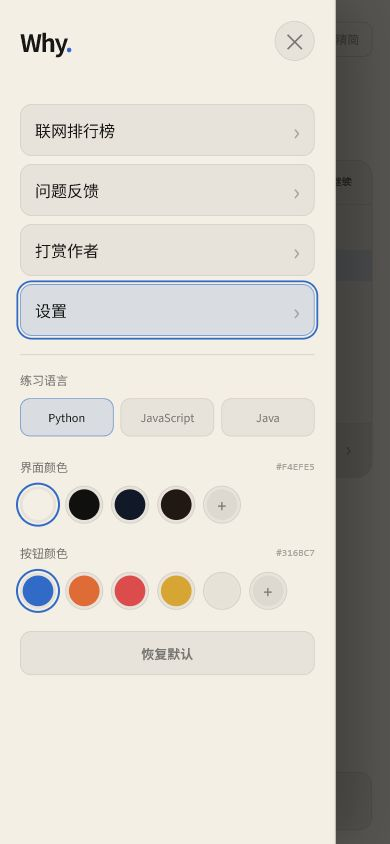
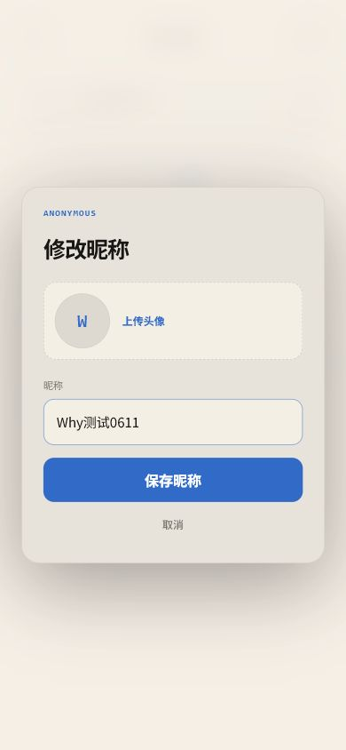
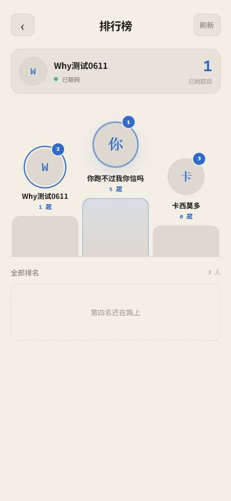

# Why

Why 是一个轻量代码学习 App。用户先阅读题目，再观看答案慢速写出；遇到不懂的代码行时，只需点 why 查看解释，再点“深一层”逐层深入。

## 最新版本

Android 交付版：**v2.1.0**

- [下载 Why v2.1.0 APK](https://github.com/XingranWang-ai/WHY-coding-app/releases/download/v2.1.0/Why-v2.1.0-debug.apk)
- [查看完整安装说明](docs/v2.0.0/安装说明.md)
- Android 7.0 及以上
- SHA-256：`6D6895262A4BE64D03563C8FFB8BE96546B6D8E065AFEF1943F5D0D0DDFD6A6F`

### v2.1.0 更新

- 修复 JSONBlob 自动过期造成的全员离线和答题记录无法上传
- 排行榜迁移到自有同步 API 与私有持久存储
- 新增请求超时、指数退避、网络恢复自动补传和前台补传
- 新增动态 API 配置，后续故障切换无需再次更换 APK
- 本机答题记录继续作为事实源，上传失败不会丢失

### v2.0.0 更新

- 首页模式选择移除辅助小字，界面更简洁
- 首页左上角可打开侧边栏
- 首页右上角账号卡可直接编辑昵称和头像
- 侧边栏新增“返回首页”
- 侧边栏新增“联系作者”，展示作者 QQ 和完整 GitHub 仓库地址
- GitHub 仓库支持一键打开，更新失败时可手动前往仓库下载
- 版本号升级至 2.0.0（versionCode 14）

## 已实现

- 学习模式：逐句讲透语法、执行过程与底层原理
- 精简模式：保留重点的三层解释
- 读题倒计时与慢速自动书写
- 慢 / 中 / 快三档书写速度
- 双击代码区或点击暂停键暂停、继续
- 已完成代码行可随时点击回看
- 手机端 why / 深一层触屏操作
- 默认 Python，可切换 JavaScript 与 Java
- 内置 108 道题，30 道高详解题优先展示
- 无密码匿名注册，只需输入昵称
- 支持上传头像，头像会压缩后与昵称一起同步
- 联网排行榜按累计刷题数量排名
- 排行榜使用独立页面，前三名在顶端突出展示
- 断网时题量保存在本机，恢复联网后继续同步
- 同步请求带超时、退避重试、前台恢复和定时补传
- 排行榜通过自有 API 写入私有持久存储，不再依赖会过期的匿名 JSONBlob
- API 地址由 GitHub 动态配置，后续迁移服务无需再次更换 APK
- 大尺寸横向滑轨可移动代码显示范围
- 侧边栏包含联系作者、问题反馈、打赏作者和设置
- 首页左上角可打开侧边栏，右上角可编辑个人资料
- 支持自定义界面颜色与按钮颜色
- 默认米白页面与蓝色按钮，设置中保留黑橙配色
- Capacitor Android 原生壳

## 界面预览

| 首页 | 学习界面 | 侧边栏 |
| --- | --- | --- |
|  |  |  |

| 匿名注册 | 联网排行榜 |
| --- | --- |
|  |  |

## 本地运行

```powershell
npm.cmd install
npm.cmd run dev
```

## Android

```powershell
npm.cmd run android:build
```

最终 APK 位于项目根目录：`Why-v2.1.0-debug.apk`。

## 同步服务

后端入口为 `server/index.mjs`，本地启动前需设置 `GITHUB_TOKEN` 和
`LEADERBOARD_GIST_ID`。Render 部署配置见 `render.yaml`，完整上线步骤见
`docs/NETWORK_RECOVERY.md`。后端提供公开同步接口、就绪检查、状态接口，以及带
`ADMIN_TOKEN` 的导出、备份、删除玩家和清空排行榜等管理员接口。
